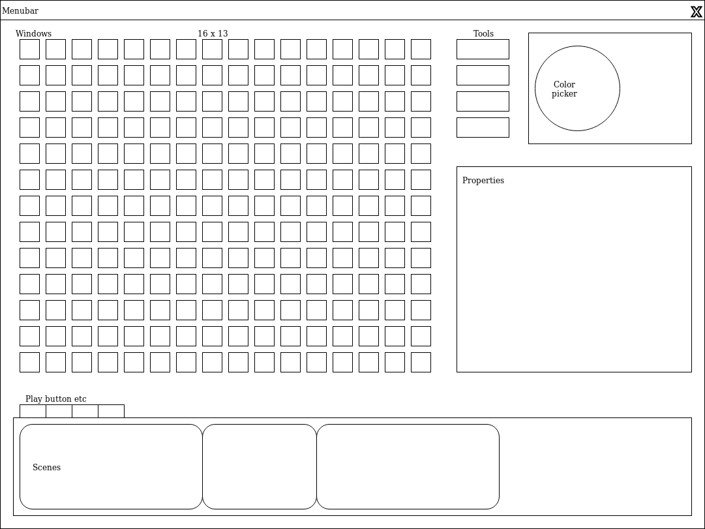

# animeditor
SCH Matrix new animeditor in Qt5

This project now uses a library called libanimeditor. You can follow the development of that library [in its own repository](https://github.com/DevTeamSCH/libanimeditor).

## Schedule
 - Creating GUI elements: Timeline, Frame editor
 - Create basic GUI to see how the finale user interface will look like
 - Specify an interface between the GUI and the internals of the application
 - Create class diagram of the internals of the program
 - Develop the internals to implement the base functionality
 - Implement extra features e.g. importing video files
 - Bug fixing
 - Release

## Specifications
 - supports old file formats (.qpx, .qp4)
 - can import videos and images
 - supports advanced editing techniques (e.g. copying, moving, selecting "pixels")
 - can set different resolutions
 - can draw primitives (e.g. circle, line etc.)
 - can interpolate between frames

### Design plan

# How to contribute

## Creating issues (bug reports, enhancement suggestions etc)
Bug reports should be clear and precise. They should describe the problem in as much detail as possible, so they will easier to reproduce and fix. You should follow these general guidelines in an issue:

* Avoid duplicate issues. Before creating a new one, check if there is a similar issue open.
* Come up with a short and concise title, that describes the problem clearly.
* Write a description of the problem or suggestion. Should contain every important detail (especially the steps required to reproduce the bug, if it's a bug report), but try to keep it clear and on topic.
* Issues are easier to read if they are formatted. You can use [GitHub flavored Markdown](https://guides.github.com/features/mastering-markdown/), which has a simple syntax but provides many possibilites to format text.

## Contributing code

### Using branches
Whenever you start working on a new feature, you should create a new branch for it. Branches should have a short name that describes the feature. When a feature is ready, create a pull request for it to get into the master branch.

### C++ coding style
Contributors should follow the [Linux kernel coding style](https://www.kernel.org/doc/html/v4.10/process/coding-style.html). Yes, it applies only to C, but it shouldn't be too hard to apply the principles to C++.

### Commit messages
Commit messages should help others understand the reasons and the contents of your change. You should write a short message in imperative.
